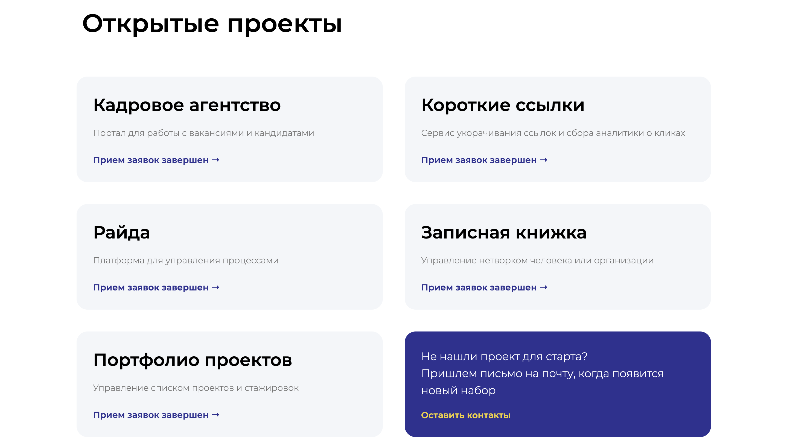

## На какие бы компоненты вы бы разбили страницу? Какая у них иерархия?

+ header - внутри логотип/ссылка и кнопка "задать вопрос";
+ main - внутри блоки проектов, каждый ведет на страницу описания выбранного проекта;
+ footer - логотип, список ссылок и контакты;

## Какие бы компонентные фреймворки вы использовали для создания страницы и почему?

+ React, он позволяет разделить страницу на компоненты не зависящие друг от друга. Актуальность приема заявок и кол-во проектов можно изменять одной переменной. переход между страницами можно реализовать с помощью "react-server".

## Напишите код, который бы автоматически отрисовывал блок со списком проектов.

+ https://arturvetrov.github.io/cloveri_project_list/

## Screenshot
